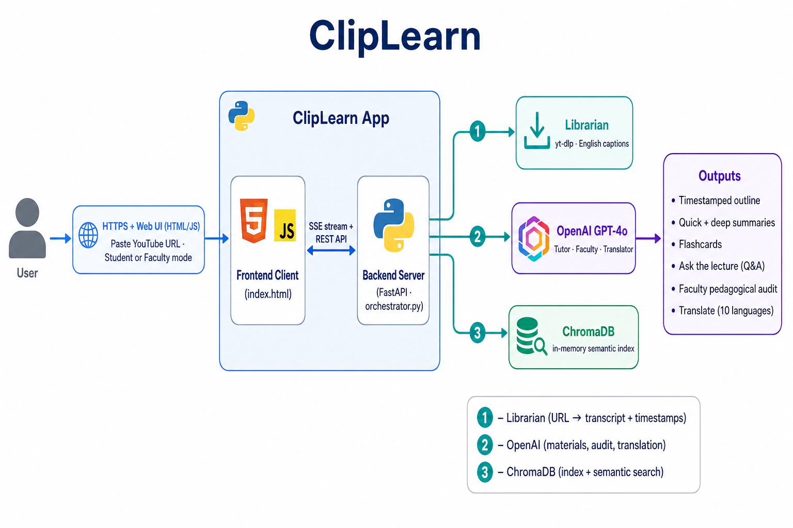

# ClipLearn

ClipLearn turns YouTube lecture videos into study materials and teaching feedback using a multi-agent pipeline. Paste a lecture URL and get timestamped outlines, summaries, flashcards, semantic Q&A (student mode), or a private pedagogical audit (faculty mode).

The web UI is served by a FastAPI backend with a single-page frontend in `templates/index.html`.

## Features

### Student mode

- **Transcript fetch** — Downloads English captions via `yt-dlp` (JSON3 or VTT).
- **Study materials** — Outline with timestamps, a short (~90s) summary, a longer (~5 min) summary, and 8 flashcards (GPT-4o).
- **Semantic search** — Ask questions about the lecture; answers include jump-to timestamps (ChromaDB + GPT-4o).
- **Translation** — Regenerate outline, summaries, and flashcards in one of 10 languages (post-processing via the Translator agent).
- **Initial language** — Optionally generate materials directly in English, Spanish, French, German, Chinese, Japanese, Arabic, Hindi, Portuguese, Korean, or Italian.

### Faculty mode

- **Lecture audit** — Scores and feedback across pedagogical quality, accessibility, equity & inclusion, and clarity.
- **Actionable output** — Top priority fix, per-dimension strengths/issues/suggestions, and timestamped rewrite examples.
- **Report export** — Print/save the audit as PDF from the browser.

## Architecture



Processing is coordinated in `orchestrator.py`. Each step is handled by an agent module under `agents/`.

**Flow**

1. **Librarian** — YouTube URL → transcript + timestamps (`yt-dlp`)
2. **OpenAI** — Study materials, faculty audit, translation (`GPT-4o`)
3. **ChromaDB** — Index lecture + semantic Q&A (in-memory)

**Inside the app:** Frontend (`index.html`) ↔ Backend (`main.py` · `orchestrator.py`) via SSE stream + REST.

### Agents

| Agent | Module | Role |
|-------|--------|------|
| Librarian | `agents/librarian.py` | Extract video ID, fetch captions with `yt-dlp`, parse chunks with timestamps |
| Tutor | `agents/tutor.py` | Validate educational content; generate outline, summaries, flashcards (OpenAI GPT-4o) |
| Search | `agents/search.py` | Index transcript segments in ChromaDB; answer questions with retrieved context |
| Translator | `agents/translator.py` | Translate study materials to a supported language |
| Faculty Auditor | `agents/faculty.py` | Pedagogical audit across four dimensions (faculty flow only) |

**Student pipeline** (Server-Sent Events on `GET /api/process`):

1. Librarian → fetch transcript  
2. Tutor → study materials  
3. Search → index for Q&A  

The Translator runs on demand via `POST /api/translate` (not during the initial stream).

**Faculty pipeline** (SSE on `GET /api/faculty`):

1. Librarian → fetch transcript  
2. Faculty Auditor → audit report  

ChromaDB uses an in-memory client (`chromadb.Client()`). Indexed data is not persisted across server restarts.

## Tech stack

- **Backend:** Python, FastAPI, Uvicorn  
- **AI:** OpenAI API (`gpt-4o`) — Tutor, Search, Translator, and Faculty agents  
- **Transcripts:** [yt-dlp](https://github.com/yt-dlp/yt-dlp) (must be available on your `PATH`)  
- **Search index:** ChromaDB (in-memory)  
- **Frontend:** HTML/CSS/JavaScript in `templates/index.html` (no separate frontend build)

## Prerequisites

- Python 3.10+ (recommended)  
- [yt-dlp](https://github.com/yt-dlp/yt-dlp) installed and on your `PATH`  
- An [OpenAI API key](https://platform.openai.com/api-keys) with access to `gpt-4o`  

## Setup

1. **Clone the repository**

   ```bash
   git clone <your-repo-url>
   cd ClipLearn
   ```

2. **Create a virtual environment and install dependencies**

   ```bash
   python -m venv venv
   source venv/bin/activate   # Windows: venv\Scripts\activate
   pip install -r requirements.txt
   pip install openai
   ```

   The application imports `openai` in several agents; install it explicitly if it is not already present after `pip install -r requirements.txt`.

3. **Configure environment variables**

   Create a `.env` file in the project root:

   ```env
   OPENAI_API_KEY=your_openai_api_key_here
   ```

4. **Verify yt-dlp**

   ```bash
   yt-dlp --version
   ```

## Run locally

From the project root with your virtual environment activated:

```bash
uvicorn main:app --reload
```

Open [http://127.0.0.1:8000](http://127.0.0.1:8000) in your browser.

Health check: `GET /health` → `{"status": "ok"}`

## API overview

| Method | Path | Description |
|--------|------|-------------|
| `GET` | `/` | Web UI |
| `GET` | `/health` | Health check |
| `GET` | `/api/process?url=...&language=...` | SSE stream: student pipeline |
| `GET` | `/api/faculty?url=...` | SSE stream: faculty audit |
| `POST` | `/api/search` | Body: `{ "question", "video_id", "language" }` |
| `POST` | `/api/translate` | Body: `{ "study_materials", "language" }` |

SSE events include `agent_start`, `agent_done`, `warning`, `error`, and `complete` (or `faculty_complete` for faculty mode).

## Project structure

```
ClipLearn/
├── main.py              # FastAPI app and routes
├── orchestrator.py      # Pipelines and SSE event streaming
├── agents/
│   ├── librarian.py     # Transcript fetch (yt-dlp)
│   ├── tutor.py         # Study materials
│   ├── search.py        # ChromaDB index + Q&A
│   ├── translator.py    # Material translation
│   └── faculty.py       # Faculty audit
├── docs/
│   └── architecture.png # Architecture diagram
├── templates/
│   └── index.html       # Frontend UI
├── static/              # Static assets mount (optional files)
├── requirements.txt
└── .env                 # Local secrets (not committed)
```

## Limitations and behavior

- **YouTube only** — URLs must be standard YouTube watch/embed/short-link formats. YouTube Shorts are rejected.  
- **Captions required** — Videos need English captions (auto-generated or manual). Auto-generated captions trigger a quality warning in the UI.  
- **Minimum length** — Fewer than 20 transcript chunks returns an error (“too short”).  
- **Educational content** — The Tutor agent checks that the transcript looks like a lecture/tutorial/course; non-educational videos may be rejected.  
- **English captions for fetch** — The Librarian requests English subtitles (`--sub-lang en`).  
- **Ephemeral index** — ChromaDB collections live in memory; restarting the server clears indexed lectures. Re-run processing to search again.  
- **Temporary files** — Caption files are written under `/tmp/{video_id}.*` during fetch.  
